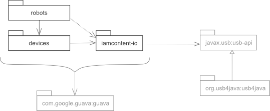

# public-java
Publicly available Java software from Greg Elderfield

IAmContent Public Libraries.

Copyright (C) 2015 Greg Elderfield

@author Greg Elderfield, support@jarchitect.co.uk

This software comprises the following packages:

* [iamcontent-core.jar](iamcontent-core) - a few utility classes and functions
* [iamcontent-io.jar](iamcontent-io) - I/O utilities and a usable facade over the javax.usb API.
* [devices](devices)
  * [iamcontent-servo-support.jar](devices/iamcontent-servo-support) -  Supports control of servos
  * [iamcontent-pololu-servo-controllers.jar](devices/iamcontent-pololu-servo-controllers) -  Servo control using Pololu Maestro cards
  * [iamcontent-owi-motor-controllers.jar](devices/iamcontent-owi-motor-controllers) -  Motor control using the Owi-535 Motor Controller
* [robots](robots)
  * [iamcontent-robotic-arm-edge.jar](robots/iamcontent-robotic-arm-edge) -  Control of the 'USB Robotic Arm Edge'

---

This program is free software; you can redistribute it and/or modify it under the terms of the GNU General Public License as published by the Free Software Foundation; either version 2 of the License, or (at your option) any later version.

This program is distributed in the hope that it will be useful, but WITHOUT ANY WARRANTY; without even the implied warranty of MERCHANTABILITY or FITNESS FOR A PARTICULAR PURPOSE. See the GNU General Public License for more details.

You should have received a copy of the GNU General Public License along with this program; if not, write to the Free Software Foundation, Inc., 51 Franklin Street, Fifth Floor, Boston, MA 02110-1301 USA.
