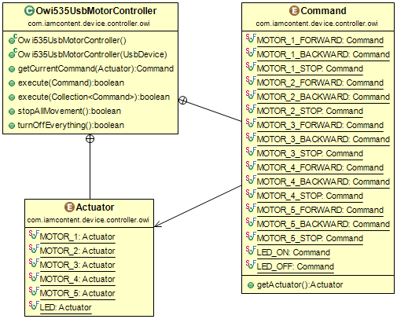

# iamcontent-owi-motor-controllers
## A publicly available library from Greg Elderfield for OWI Motor Controller Boards.

This jar contains a single class that allows commands to be issued to an Owi-535 Motor Controller via USB.

---

This software comes with ABSOLUTELY NO WARRANTY. This is free software, and you are welcome to redistribute it
under the terms of the [GNU GENERAL PUBLIC LICENSE Version 2](https://www.gnu.org/licenses/gpl-2.0.html).
