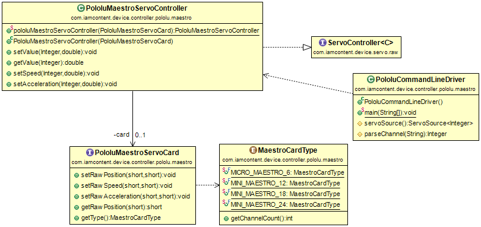

#Java package: _pololu.maestro_

Defines the servo functions required of a Pololu Maestro card and allows these functions to be used with the [iamcontent-servo-support](../../../../iamcontent-servo-support) jar.

_MaestroCardType_ enumerates the different types of Pololu Maestro cards.

_PololuMaestroServoCard_ defines a minimal set of functions that are required of a Pololu Maestro card.

_PololuMaestroServoController_ wraps a _PololuMaestroServoCard_ as a [ServoController](../../../../iamcontent-servo-support/src/site/md/com.iamcontent.device.servo.raw.md).

The _PololuCommandLineDriver_ provides an example usage and can be run from the command line for testing purposes. It supports the following commands:

|Command|Format|Example|Example Description|
| ---- | ---- | ---- | ---- |
| Set position | _channel position_ | 1 0.34 | For the servo on channel 1: set its position to 0.34. |
| Set position & speed | _channel position speed_ | 1 0.34 0.2 | For the servo on channel 1: set its speed to 0.2 and then set its position to 0.34. |
| Set position, speed & acceleration | _channel position speed acceleration_ | 1 0.34 0.2 0.15 | For the servo on channel 1: set its acceleration to 0.15, then set its speed to 0.2 and then set its position to 0.34. |
| Get position | ? _position_ | ?3 | Get the position of the servo on channel 3. |

Note that the _PololuCommandLineDriver_ uses a [ServoSourceCalibrator](../../../../iamcontent-servo-support/src/site/md/com.iamcontent.device.servo.calibrate.md) so that the input position, speed and acceleration values are all in the range 0.0..1.0. The configuration file for this is at [src/main/resources/servo/calibration/pololu-maestro.json](../../main/resources/servo/calibration/pololu-maestro.json).

Examine [RawPololuMaestroServoSourceIT.java](../../test/java/com/iamcontent/device/controller/pololu/maestro/RawPololuMaestroServoSourceIT.java) for a simple example of how to drive a Pololu Maestro servo as a [raw ServoSource](../../../../iamcontent-servo-support/src/site/md/com.iamcontent.device.servo.raw.md).

Examine [CalibratedPololuMaestroServoSourceIT.java](../../test/java/com/iamcontent/device/controller/pololu/maestro/CalibratedPololuMaestroServoSourceIT.java) for a simple example of how to drive a Pololu Maestro servo as a [calibrated ServoSource](../../../../iamcontent-servo-support/src/site/md/com.iamcontent.device.servo.calibrate.md).

---

This software comes with ABSOLUTELY NO WARRANTY. This is free software, and you are welcome to redistribute it
under the terms of the [GNU GENERAL PUBLIC LICENSE Version 2](https://www.gnu.org/licenses/gpl-2.0.html).
