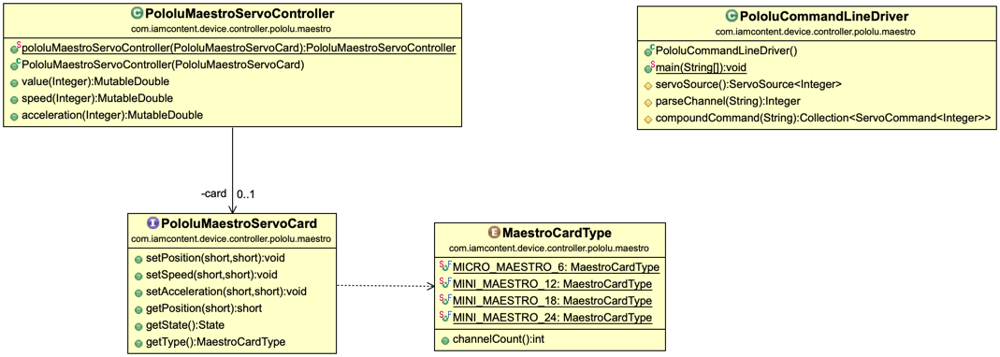

#Java package: _pololu.maestro_

Defines the  servo functions required of a Pololu Maestro card and allows these functions to be used with the [iamcontent-servo-support](../../../../iamcontent-servo-support) jar.

_MaestroCardType_ enumerates the different types of Pololu Maestro cards.

_PololuMaestroServoCard_ defines a minimal set of functions that are required of a Pololu Maestro card.

_PololuMaestroServoController_ wraps a _PololuMaestroServoCard_ as a [ServoController](../../../../iamcontent-servo-support/src/site/md/com.iamcontent.device.servo.raw.md).

The _PololuCommandLineDriver_ provides an example usage and can be run from the command line for testing purposes. It supports the following commands (position, speed and acceleration values are all in the range 0.0..1.0):

|Format|Description|Example|Example Description|
| ---- | ---- | ---- | ---- |
|<channel> <position> | 1 0.34 | Set the servo on channel 1 to position 0.34 |

---

This software comes with ABSOLUTELY NO WARRANTY. This is free software, and you are welcome to redistribute it
under the terms of the [GNU GENERAL PUBLIC LICENSE Version 2](https://www.gnu.org/licenses/gpl-2.0.html).
