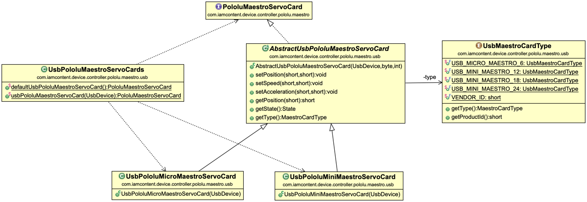

#Java package: _pololu.maestro.usb_

Implements the servo functions required of a Pololu Maestro card using the Pololu Native USB protocol.

_UsbMaestroCardType_ enumerates the different types of Pololu Maestro cards, holding USB-related data for each card type.

_AbstractUsbPololuMaestroServoCard_ uses Pololu's Native USB protocol to partially implement the [PololuMaestroServoCard](com.iamcontent.device.controller.pololu.maestro.md) functions. Functions that require different implementations for different card types are implemented by the concrete subclasses _UsbPololuMicroMaestroServoCard_ and _UsbPololuMiniMaestroServoCard_.

_UsbPololuMaestroServoCards_ provides factory methods for creating the correct concrete implementation for a given _UsbDevice_ (or, alternatively, for the first Pololu Maestro _UsbDevice_ that is found).

Examine [UsbPololuMaestroServoCardIT.java](../../test/java/com/iamcontent/device/controller/pololu/maestro/usb/UsbPololuMaestroServoCardIT.java) for a simple example of how to use this package.

---

This software comes with ABSOLUTELY NO WARRANTY. This is free software, and you are welcome to redistribute it
under the terms of the [GNU GENERAL PUBLIC LICENSE Version 2](https://www.gnu.org/licenses/gpl-2.0.html).
