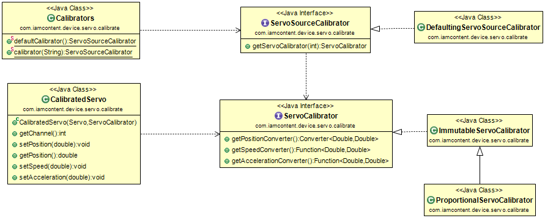

#Java package: _servo.calibrate_

A _CalibratedServo_ wraps another _Servo_ (usually a [RawServo](com.iamcontent.device.servo.raw.md)) and delegates to it after converting position, speed and acceleration values according to a _ServoCalibrator_. A _ServoSourceCalibrator_ can provide _ServoCalibrator_ objects for all of the [Servo](com.iamcontent.device.servo.md) objects of a [ServoSource](com.iamcontent.device.servo.md).

A _DefaultingServoSourceCalibrator_ allows a default _ServoCalibrator_ to be set but over-ridden on a per-channel basis.

A _ProportionalServoCalibrator_ proportionally scales its input values to create its output values. This allows a _Servo_ to be created that has a meaningful range for its input value (e.g. -180.0..180.0 or 0.0..1.0), which is independent of the range of the output value; the latter range is often the raw value required by a _ServoController_ (e.g. 1000..2000, representing the pulse length in µS that should be sent to a physical servo).

The _Calibrators_ class has convenient factory methods for creating _ServoSourceCalibrator_ objects, allowing them to be read from a JSON file. The default calibration file can be found at src/main/resources/servo/default-calibration.json. Alternatively, a _ServoSourceCalibrator_ named XXX can be obtained, which will be constructed based on the JSON file at src/main/resources/servo/XXX.json. Finally, the name of the default configuration can be changed from _default-calibration_ by setting the _iamcontent.servo.calibration_ System property.

---

This software comes with ABSOLUTELY NO WARRANTY. This is free software, and you are welcome to redistribute it
under the terms of the [GNU GENERAL PUBLIC LICENSE Version 2](https://www.gnu.org/licenses/gpl-2.0.html).
