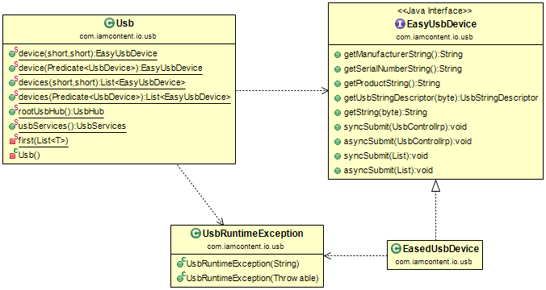

# Java package: _usb_

Provides a simple facade over the [javax.usb](http://sourceforge.net/projects/javax-usb/) API.

Configured in [src/main/resources/javax.usb.properties](../../resources/javax.usb.properties) to use the [usb4java](http://usb4java.org/) implementation of [javax.usb](http://sourceforge.net/projects/javax-usb/).

The most common use case is to find USB devices from the root USB hub by invoking the _Usb.device()_ or _Usb.devices()_ methods:

      List<EasyUsbDevice> devices = Usb.devices(vendorId, productId);
      EasyUsbDevice oneDevice = Usb.device(vendorId, productId);

For testing, this can be done from the command line by running the _UsbTestDriver_ class and providing the vendor id and product id as command line arguments.

The returned objects implement the _EasyUsbDevice_ interface, which extends the standard _java.usb.UsbDevice_ interface but throws _UsbRuntimeExceptions_ instead of checked exceptions.

The _Usb_ class also has methods that accept a _Predicate_ to allow more specific device selection.

---

This software comes with ABSOLUTELY NO WARRANTY. This is free software, and you are welcome to redistribute it
under the terms of the [GNU GENERAL PUBLIC LICENSE Version 2](https://www.gnu.org/licenses/gpl-2.0.html).
