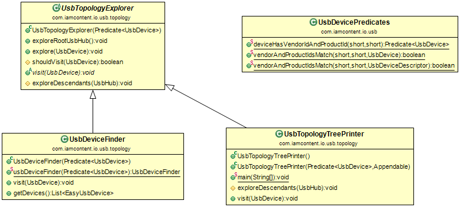

# Java package: _usb.topology_

Provides a mechanism for searching a USB topology for devices.

The abstract class _UsbTopologyExplorer_ recursively explores the USB topology, visiting any _UsbDevice_ that satisfies a given _Predicate_. Concrete implementations determine what to do when a _UsbDevice_ is visited.

The _UsbDeviceFinder_ searches for devices that satisfy a given _Predicate_. An example of its use can be seen in the _Usb.devices_ method, of the [usb](usb.md) package.

The _UsbTopologyTreePrinter_ can be run from the command line to print the USB topology to _System.out_ in a simple tree format.

---

This software comes with ABSOLUTELY NO WARRANTY. This is free software, and you are welcome to redistribute it
under the terms of the [GNU GENERAL PUBLIC LICENSE Version 2](https://www.gnu.org/licenses/gpl-2.0.html).
