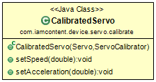

# Java package: _servo.calibrate_

A _CalibratedServo_ wraps another _Servo_ (usually a [RawServo](com.iamcontent.device.servo.raw.md)) and delegates to it after converting position, speed and acceleration values according to a _ServoCalibrator_. A _ServoSourceCalibrator_ can provide _ServoCalibrator_ objects for all of the [Servo](com.iamcontent.device.servo.md) objects of a [ServoSource](com.iamcontent.device.servo.md).

A _DefaultingServoSourceCalibrator_ allows a default _ServoCalibrator_ to be set but over-ridden on a per-channel basis.

---

This software comes with ABSOLUTELY NO WARRANTY. This is free software, and you are welcome to redistribute it
under the terms of the [GNU GENERAL PUBLIC LICENSE Version 2](https://www.gnu.org/licenses/gpl-2.0.html).
