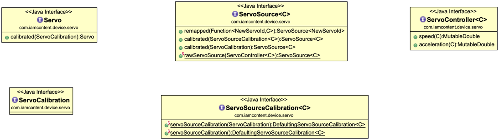

# Java package: _servo_

A _ServoController_ sets the position, speed and acceleration values of a group of servos, using raw values that are specific to the firmware of a physical servo controller. The _RawServo_ class is a _Servo_ that directly delegates its operations to a _ServoController_ without altering the values of the operations.

A _RawServo_ can be used 'as is' but it is often more convenient to wrap it in a _CalibratedServo._

A _ServoSource_  allows _Servo_  objects to be obtained by their channel ids.

The _ServosSource_  interface has convenient factory methods for creating a _ServoSource,_ of _RawServos,_ which interact with a _ServoController._

_Servos_ and _ServoSources_ have _calibrated()_ methods that can be used to obtain calibrated proxies. 

---

This software comes with ABSOLUTELY NO WARRANTY. This is free software, and you are welcome to redistribute it
under the terms of the [GNU GENERAL PUBLIC LICENSE Version 2](https://www.gnu.org/licenses/gpl-2.0.html).
