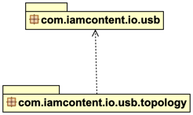

# iamcontent-usb.jar
## A publicly available I/O library from Greg Elderfield.

This jar contains two main packages of interest:

* the [usb](src/site/md/usb.md) package 
* the [usb.topology](src/site/md/usb.topology.md) package

These packages provide a usable facade over the [javax.usb](http://sourceforge.net/projects/javax-usb/) API. This library is configured to use the [usb4java](http://usb4java.org/) implementation of [javax.usb](http://sourceforge.net/projects/javax-usb/).

---

This software comes with ABSOLUTELY NO WARRANTY. This is free software, and you are welcome to redistribute it
under the terms of the [GNU GENERAL PUBLIC LICENSE Version 2](https://www.gnu.org/licenses/gpl-2.0.html).
