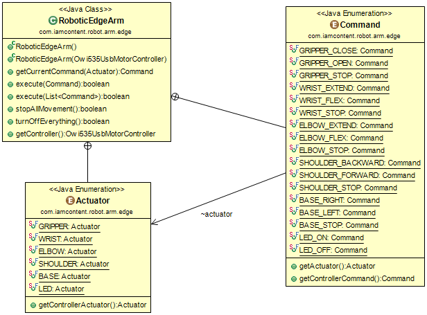

# iamcontent-robotic-arm-edge
## A publicly available library from Greg Elderfield to control the 'USB Robotic Arm Edge'

The 'USB Robotic Arm Edge' is an educational toy, available from OWIRobot.com or Maplin.co.uk.

The main class of this jar is _RoboticEdgeArm_, which allows commands to be issued to the Robotic Edge Arm via USB.

For testing, run the _RoboticEdgeArmCommandLineDriver_ class. Examine the _ParseStringIntoCommandFunction_ class to see the supported syntax.

---

This software comes with ABSOLUTELY NO WARRANTY. This is free software, and you are welcome to redistribute it
under the terms of the [GNU GENERAL PUBLIC LICENSE Version 2](https://www.gnu.org/licenses/gpl-2.0.html).
